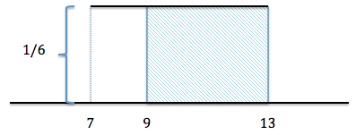

```{r setup, include=FALSE}
knitr::opts_chunk$set(echo = TRUE)
library(plotly)
```

**This demonstration is used to teach about: **

  1. The uniform distribution
  2. Random sampling
  3. The notion of long term probability.
  
**Context and Setup**

I use this demonstration in the second class of the probability unit. In our first class we introduce the notion of long term vs short term probability. A variable is random if it's outcome is unknown in one trial but follows a consistent pattern over a long series of trials. We define probability of an event as the long term proportion of successes in an infinite number of trials and discuss how the larger the number of trials, the closer the observed proportion of successes will be to the actual probability. 

In our second class we introduce continuous probability distributions and relate the notion of area=probability=proportion. The help with this, we start with the easiest to visualize distribution, the uniform distribution as it is a rectangle and easy to calculate area. 

After show how to draw a uniform density curve and how to calculate the height of the distribution as $\dfrac{1}{\text{base}}$, we answer the following question:

Let $X$ be a random variable following a uniform distribution from 7 to 13. What is $P(X>9)$?

First we draw the picture of the distribution, shade in the picture according to the "instructions" of $X>9$:

<center>

 

</center>


<!--  -->


and then we solve using math:

\begin{align*}
\text{Area} &= \text{Base}\times\text{height}\\
\text{Area} &= (13-9)\times \dfrac{1}{6}\\
\text{Area} &= 4\times \dfrac{1}{6}\\
P(X>9) &= \dfrac{4}{6}\approx 0.667
\end{align*}

It is at this point that we can call back to the previous lecture and start our simulation. 

**The Simulation**

We recall back to our idea that area=proportion=probability. If our definition of long-term probability is the proportion of successes that occur in an infinite number of trials, if we repeatedly sample with increasingly large sample sizes from our $Unif(7,13)$ then we should see a proportion of successes that approaches our area of 2/3.
  
While writing functions and loop structures is not a part of my intro stats class, I do make a point of explaining what my functions do. I talk them through the following code:

  1. It generates $n$ observations from the $Unif(7,13)$ distribution.
  2. If we toggle the option T for the print variable, it will print each observation with an indication of whether it is greater than 9 (TRUE) or less than 9 (FALSE).
  3. It will count how many of our observations are between 9 and 13 and print out the proportion $\dfrac{(\text{Number of observations greater than our equal to 9})}{n}$ 
  
```{r}
 #Function for simulating uniform(7, 13) random variables and determining the proportion greater than or equal to 9
# n : sample size
# print : TRUE/FALSE for printing vector with observations and true/false-ness

simulation<-function(n, print)
{
  #Generate n random uniform observations on (7,13)
  obs<-runif(n, 7, 13)
  
  #If print=T, print vector of observations and vector of T/F values
  if(print==T){
    print(obs)
    print((obs>=9)==TRUE)
  }
  
  #Count proportion where >=9 is true out of n observations
  sum((obs>=9&obs<=13)==TRUE)/n
  
}
```

To show how this works, I always start out by running the simulation for a sample of size 10 and printing out the observations using the T variable in my function:

```{r echo=FALSE}
set.seed(3445)
```

```{r}
#Test for sample of size 10 with output printed. 
simulation(10,T)
```
It's good to go through at least the first few observations: 10.25 is greater than 9 so it gets a TRUE, same with 9.46. Then 7.21 is less than 9 so it gets a FALSE. In total, their are four observations less than 9, there are four FALSE indications and the proportion of successes given is 0.6. It is good to point out here as well that all 10 observations are between 7 and 13. 

Next we run the simulation for increasingly large sample sizes and watch how we can see the proportion of successes get closer and closer to 2/3 as the sample size gets larger. 

```{r}
simulation(100,F)
simulation(10000,F)
simulation(100000,F)
simulation(1000000,F)
```

While the helps get across the idea of convergence, it doesn't show how variability decreases over time. To do this we add in one simulation in at the end where we plot and track the proportion of successes over n increasingly larger number of trials. 

The following code creates an empty vector and then runs the simulation 1000 times starting with a sample of size 100 and increasing by 100 each time. R records the proportion of succeses in the vector and then plots the proportions against the sample size. 

```{r}
#Create an empty numeric vector
prop<-vector('numeric')

#Create a vector with 1000 instances of function with sample size increasing by 100
for(k in 1:1000){
  
  prop<-c(prop,simulation(100*k,F))
  
}
 
#Create a vector of possible sample sizes
num<-c(1:1000)
num<-num*100

#Plot sample size vs proportion, "l" option says to plot using a line
plot(num, prop, type="l", lheight=1.5)
abline(h=(2/3), col="red")
```

When going over the graph it's important to note that we are seeing less and less variability as the value converges and small streaks of failures or successes don't make as much of a difference on the proportion. We also add in the red line at 2/3 to see that it is in fact converging to the value we thought it should!

**Summary**
At the end of the simulation it is important to restate the purpose of the exercise. In summary we learned that:

  1. The area underneath a density curve in a particular region is the same thing as the probability of observing a value in that region. 
  2. If we repeatedly sample from a distribution, the proportion of observations that fall in a region converges to the probability of being in that region. 
  3. We see increasingly less sampling variability as we increase our sample size. 
  4. Our simulation agreed with our mathematical calculation which suggests it may be a good approximation in other problems when it is not so easy to calculate the area by hand or we'd like a rough aproximation.
  
**Code Link **
You can find a <a href="https://github.com/jtichon/Simulations_teaching/blob/master/unif/uniformsimulation.R"> link to the code </a> at my <a href="https://github.com/jtichon"> GitHub Repository </a>. 
